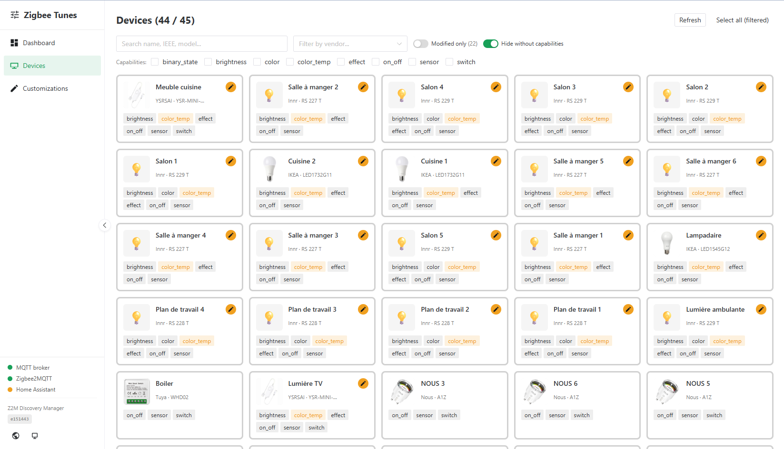
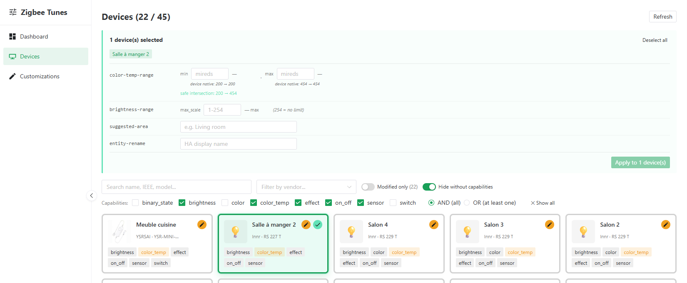
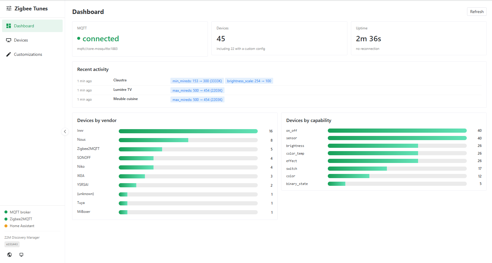

# Zigbee Tunes

**Normalise ce que Home Assistant voit de tes appareils Zigbee2MQTT — sans toucher aux appareils eux-mêmes.**

[](https://github.com/Noodlex/zigbee-tunes/releases)
[](LICENSE)
[](https://github.com/Noodlex/zigbee-tunes/actions/workflows/ci.yml)
[](https://claude.com/claude-code)

> Other languages: [English](README.md)

Zigbee Tunes est une petite app Home Assistant qui s'interpose **entre
Zigbee2MQTT et Home Assistant** sur le canal MQTT Discovery. Il intercepte
les payloads de découverte publiés par Z2M, applique les transformations
que tu définis — borner les plages de température de couleur, plafonner la
luminosité, renommer des appareils, assigner des pièces — puis les
republie. Home Assistant obtient une **vue cohérente et harmonisée** d'un
parc multi-marques, sans jamais modifier tes appareils Zigbee physiques.

<p align="center">
  
</p>

## Pourquoi

Z2M annonce chaque appareil avec ses capacités natives. Quand le parc
mélange des marques aux plages différentes (Innr 2200–5000K, IKEA
2200–4000K, contrôleurs WW/CW génériques 2000–6500K…), Home Assistant
affiche des curseurs de température de couleur incohérents et le contrôle
groupé devient pénible.

Zigbee Tunes permet de **modeler la vue au niveau discovery** que reçoit
HA — appareil par appareil ou en masse, depuis une petite UI web. C'est un
**normaliseur en sens unique** : il réécrit ce que HA *voit*, il ne pilote
pas tes appareils et n'est pas un moteur d'automatisation.

## Fonctionnalités

- **Quatre transformers** — `color-temp-range` (borner min/max mireds),
  `brightness-range` (plafonner l'échelle), `suggested-area` (assigner des
  pièces HA), `entity-rename` (renommage d'affichage sans casse).
- **Six patterns de ciblage** — `*`, `<ieee>`, `@vendor:`, `@group:`,
  `@model:`, `@friendlyname:` (avec match par préfixe `*`).
- **UI web** (via HA Ingress) — grille Devices avec sélection multiple et
  aide « intersection sûre » en édition groupée de température de couleur ;
  registre Customizations avec annulation en un clic ; Dashboard avec statut
  de connexion et répartition du parc. Anglais/français, dark/light,
  responsive.
- **Smart-apply atomique** — appliquer une règle remplace toute règle
  existante du même type pour cet appareil (pas d'accumulation de doublons).
- **Fiable** — cache de discovery par topic : un changement de règle
  atteint la bonne entité sans attendre un redémarrage de Z2M.

<p align="center">
  
</p>

## Installation

### Comme app Home Assistant (recommandé)

[](https://my.home-assistant.io/redirect/supervisor_add_addon_repository/?repository_url=https%3A%2F%2Fgithub.com%2FNoodlex%2Fzigbee-tunes)

1. Clique le bouton ci-dessus (ou, dans Home Assistant, ouvre
   **Paramètres → Apps**, puis le menu **⋮** → **Dépôts**, et colle
   `https://github.com/Noodlex/zigbee-tunes`).
2. Ouvre la boutique et installe **Zigbee Tunes**.
3. Assure-toi qu'un broker MQTT (ex. **Mosquitto broker**) tourne.
4. Fais pointer Z2M sur un topic de discovery séparé (voir
   [Configuration](#configuration)), redémarre Z2M, puis démarre Zigbee
   Tunes. L'UI apparaît dans la sidebar HA.

Nécessite **Home Assistant OS** ou **Supervised** (les apps ont besoin
du Supervisor). Architectures : `amd64`, `aarch64`.

### Standalone (Docker)

Pas sur HA OS ? Lance-le comme un conteneur à côté de n'importe quel broker :

```bash
docker compose --profile full up -d
docker compose logs -f zigbee-tunes
```

Voir [config.example.yaml](config.example.yaml) pour la configuration complète.

## Configuration

Zigbee Tunes intercepte la discovery de Z2M sur un topic que HA ne surveille
pas, puis republie vers celui qu'il surveille. Fais pointer Z2M sur un topic
de discovery séparé :

```yaml
# configuration.yaml de Zigbee2MQTT
homeassistant:
  discovery_topic: z2m_discovery   # au lieu du défaut "homeassistant"
```

Redémarre Z2M. Ses payloads arrivent maintenant sur `z2m_discovery/…` ;
Zigbee Tunes les transforme et republie sur `homeassistant/…`. HA ne voit
que la version post-transformation.

Pour revenir en arrière : remets `discovery_topic` à `homeassistant`,
redémarre Z2M, arrête Zigbee Tunes.

## Comment ça marche

```
Maillage Zigbee
   │
   ▼
Zigbee2MQTT ──publie──►  Broker MQTT  (z2m_discovery/*)
                             │
                             ▼
                        Zigbee Tunes ──republie──► Broker MQTT (homeassistant/*)
                                                        │
                                                        ▼
                                                 Home Assistant
```

L'**état et les commandes des appareils ne sont pas touchés** — ils
transitent directement Z2M ↔ HA. Seuls les payloads MQTT Discovery (config)
retained passent par Zigbee Tunes.

<p align="center">
  
</p>

## Documentation

- [Docs de l'app](addon/zigbee-tunes/DOCS.md) — options, usage, stockage
- [README de l'app](addon/zigbee-tunes/README.md) — détails d'installation
- [CONTRIBUTING](CONTRIBUTING.md) — setup dev et conventions
- [SECURITY](SECURITY.md) — modèle de confiance et signalement

## Sécurité

L'UI web et l'API REST n'ont **aucune authentification par conception** —
on y accède via HA Ingress (authentifié par HA) ou en loopback en mode
standalone. **N'expose pas le port 8099 sur un réseau non fiable.** Voir
[SECURITY.md](SECURITY.md).

## Avertissement

Zigbee Tunes est un projet communautaire indépendant. Il n'est **ni
affilié, ni approuvé, ni sponsorisé** par la Connectivity Standards
Alliance (Zigbee®), le projet Zigbee2MQTT, ou Home Assistant / l'Open Home
Foundation. « Zigbee », « Zigbee2MQTT » et « Home Assistant » sont les
marques de leurs propriétaires respectifs ; elles ne sont utilisées ici que
pour décrire l'interopérabilité.

## Fait avec Claude

Ce projet a été conçu et développé en collaboration avec
[Claude](https://claude.com/claude-code), l'assistant IA d'Anthropic —
architecture, backend, UI, packaging, tests et docs. Les contributions des
humains et de leurs assistants IA sont également les bienvenues.

## Licence

[MIT](LICENSE) © Noodlex
