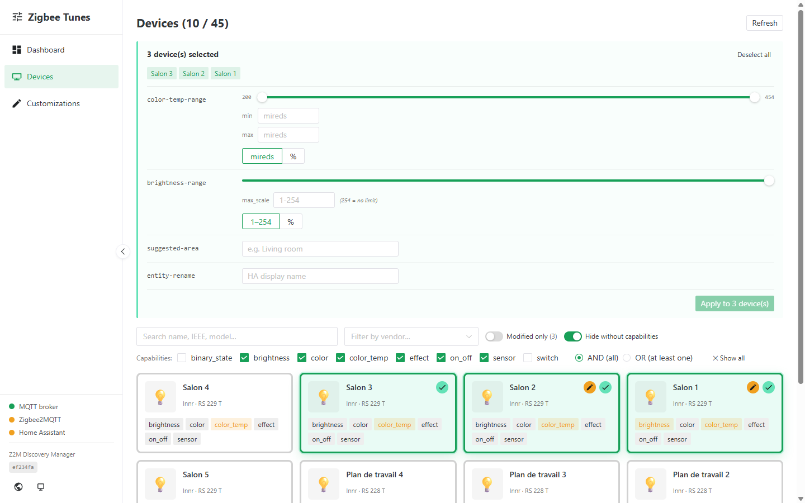
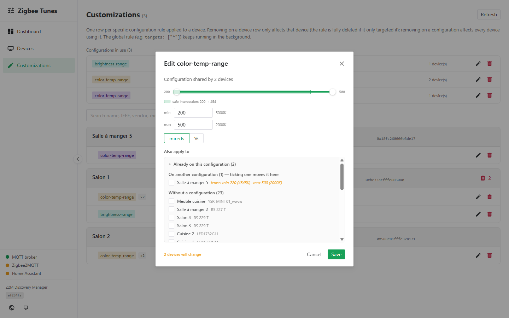
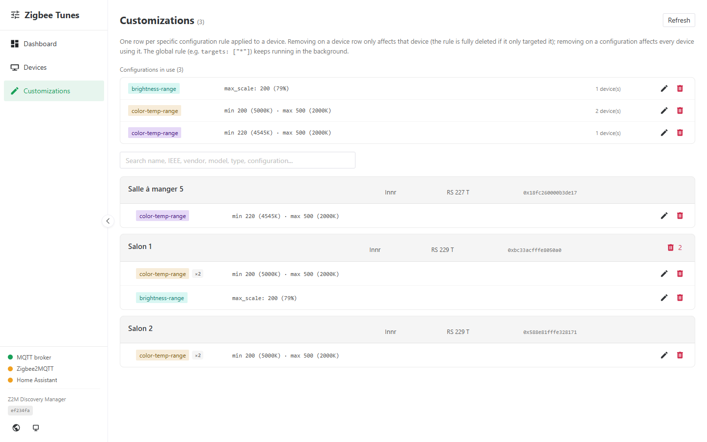
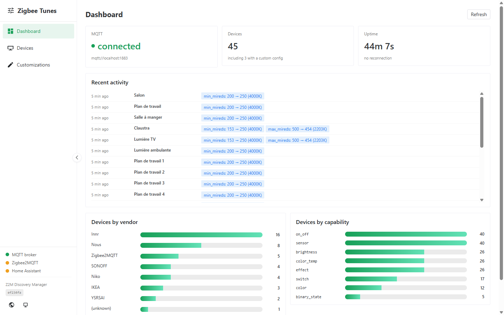

# Zigbee Tunes

**Normalize what Home Assistant sees about your Zigbee2MQTT devices — without touching the devices themselves.**

[](https://github.com/Noodlex/zigbee-tunes/releases)
[](LICENSE)
[](https://github.com/Noodlex/zigbee-tunes/actions/workflows/ci.yml)
[](https://claude.com/claude-code)

> Other languages: [Français](README.fr.md)

Zigbee Tunes is a small Home Assistant app that sits **between
Zigbee2MQTT and Home Assistant** on the MQTT Discovery channel. It
intercepts the discovery payloads Z2M publishes, applies transformations
you define — clamp color-temperature ranges, cap brightness, rename
devices, assign areas — and republishes them. Home Assistant ends up with
a **consistent, harmonized view** of a mixed-brand fleet, while your
physical Zigbee devices are never modified.

<p align="center">
  
</p>

## Why

Zigbee Tunes started as a personal project: I couldn't find an existing
way to normalize what Home Assistant sees from Z2M, so I built one to fill
that gap in the Home Assistant ecosystem.

Z2M advertises each device with its native capabilities. When your fleet
mixes brands with different ranges (Innr 2200–5000K, IKEA 2200–4000K,
generic WW/CW controllers 2000–6500K…), Home Assistant shows inconsistent
color-temperature sliders, and grouped control gets painful.

Zigbee Tunes lets you **shape the discovery-level view** HA receives — per
device or in bulk, from a small web UI. It is a **one-way normalizer**: it
rewrites what HA *sees*, it does not control your devices and is not an
automation engine.

## Features

- **Four transformers** — `color-temp-range` (clamp min/max mireds),
  `brightness-range` (cap the scale), `suggested-area` (auto-assign HA
  areas), `entity-rename` (safe display-name override).
- **Six targeting patterns** — `*`, `<ieee>`, `@vendor:`, `@group:`,
  `@model:`, `@friendlyname:` (with `*` prefix match).
- **Configurations, not just rules** — devices normalized identically share a
  configuration and a colour throughout the UI. Change one and every device
  using it follows; or split a single device off into a configuration of its
  own, without leaving the dialog.
- **Ranges on a slider**, bounded by what the targeted devices actually
  support, in mireds **or as a percentage**. The span every one of them can
  honour is drawn on the track, so you can see what a bound costs before
  committing to it.
- **Assign from the editor** — the dialog that defines a configuration also
  lists the fleet, separating devices that would *move off* another
  configuration from those that have none. Applying a rule drops a device from
  its previous one of the same type, and that shows.
- **Web UI** (through HA Ingress) — Devices grid with multi-select and
  capability filters; Customizations ledger with one-click undo; Dashboard
  with connection status, recent activity and a fleet breakdown.
  English/French, dark/light, responsive.
- **Atomic smart-apply** — applying a rule replaces any existing rule of
  the same type for that device (no duplicate accretion).
- **Reliable** — per-topic discovery cache so a rule change reaches the
  right entity without waiting for a Z2M restart.

<p align="center">
  
</p>

Every distinct configuration is listed with the devices using it, so a fleet
normalized three different ways reads as three lines rather than forty:

<p align="center">
  
</p>

## Install

### As a Home Assistant app (recommended)

[](https://my.home-assistant.io/redirect/supervisor_add_addon_repository/?repository_url=https%3A%2F%2Fgithub.com%2FNoodlex%2Fzigbee-tunes)

1. Click the button above (or in Home Assistant open **Settings → Apps**,
   then the **⋮** menu → **Repositories**, and paste
   `https://github.com/Noodlex/zigbee-tunes`).
2. Open the store and install **Zigbee Tunes**.
3. Make sure an MQTT broker app (e.g. **Mosquitto broker**) is running.
4. Point Z2M at a separate discovery topic (see [Configuration](#configuration)),
   restart Z2M, then start Zigbee Tunes. The UI appears in the HA sidebar.

Requires **Home Assistant OS** or **Supervised** (apps need the
Supervisor). Architectures: `amd64`, `aarch64`.

### Standalone (Docker)

Not on HA OS? Run it as a plain container next to any MQTT broker:

```bash
docker compose --profile full up -d
docker compose logs -f zigbee-tunes
```

See [example-config.yaml](example-config.yaml) for the full configuration.

## Configuration

Zigbee Tunes works by intercepting Z2M's discovery on a topic HA doesn't
watch, then republishing to the one it does. Point Z2M at a separate
discovery topic:

```yaml
# Zigbee2MQTT configuration.yaml
homeassistant:
  discovery_topic: z2m_discovery   # instead of the default "homeassistant"
```

Restart Z2M. Its payloads now land on `z2m_discovery/…`; Zigbee Tunes
transforms them and republishes on `homeassistant/…`. HA only ever sees
the post-transformation view.

To revert: set `discovery_topic` back to `homeassistant`, restart Z2M,
stop Zigbee Tunes.

## How it works

```
Zigbee mesh
   │
   ▼
Zigbee2MQTT ──publish──►  MQTT broker  (z2m_discovery/*)
                              │
                              ▼
                         Zigbee Tunes ──republish──► MQTT broker (homeassistant/*)
                                                          │
                                                          ▼
                                                   Home Assistant
```

Device **state and commands are untouched** — they flow Z2M ↔ HA directly.
Only the retained MQTT Discovery (config) payloads pass through Zigbee
Tunes.

<p align="center">
  
</p>

## Documentation

- [App docs](addon/zigbee-tunes/DOCS.md) — options, usage, storage
- [App README](addon/zigbee-tunes/README.md) — install details
- [CONTRIBUTING](CONTRIBUTING.md) — dev setup and conventions
- [SECURITY](SECURITY.md) — trust model and reporting

## Security

The web UI and REST API have **no authentication by design** — they are
reached through HA Ingress (authenticated by HA) or bound to loopback in
standalone mode. **Do not expose port 8099 to an untrusted network.** See
[SECURITY.md](SECURITY.md).

## Disclaimer

Zigbee Tunes is an independent, community project. It is **not affiliated
with, endorsed by, or sponsored by** the Connectivity Standards Alliance
(Zigbee®), the Zigbee2MQTT project, or the Home Assistant / Open Home
Foundation. "Zigbee", "Zigbee2MQTT" and "Home Assistant" are the marks of
their respective owners; they are used here only to describe
interoperability.

## Built with Claude

This project was designed and built collaboratively with
[Claude](https://claude.com/claude-code), Anthropic's AI assistant —
architecture, backend, UI, packaging, tests and docs. Contributions from
humans and their AI assistants are equally welcome.

## License

[MIT](LICENSE) © Noodlex
